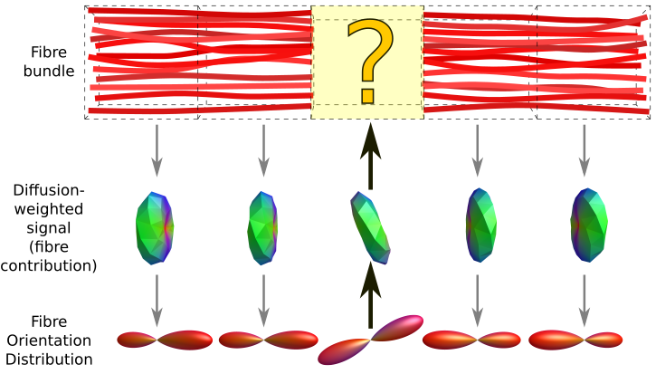

The data and code in this repository are written in response to:

Andrew Zalesky, Tabinda Sarwar, Ramamohanarao Kotagiri
SIFT in pathological connectomes: Follow‐up response to Smith and colleagues
Magnetic Resonance in Medicine, 2020, 84(5), 2308-2311

For previous demonstrations see:
http://github.com/Lestropie/Sarwar2019
http://github.com/Lestropie/Zalesky2020

## Example 1: Multifocal lesions


File `script_2path` reproduces this simulated pathology under a number of different experimental scenarios.
The originally reported issue reported error in quantification (an erroneous 14% increase in bundle 2 in the patient) arises specifically due to the isolated voxel in bundle 1 that has non-zero fibre density but zero streamlines density.
As demonstrated by the output of the script (see below), this issue only occurs if *all of the following three* are true:

1.  SIFT is used rather than SIFT2.
    While the "non-integer solution"—intended to mimic the SIFT2 method—was reported to suffer from this issue, the actual SIFT2 method itself *does not*.

2.  Seeding is performed exclusively from the bundle endpoints (akin to seeding from the GM-WM interface).
    In populations where multiple large lesions may make entire regions of white matter accessible to streamlines tractography, despite seeding from all cortical and sub-cortical grey matter regions, I would recommend using some other seeding mechanism.

    

3.  Fixels with no streamlines density are nevertheless retained in the model, rather than being removed prior to optimisation.
    The original rationale for this being the default command behaviour is no longer relevant following the recent formal definition of [the Fibre Bundle Capacity (FBC) metric](https://osf.io/c67kn/); as such, this behaviour was already slated for change in a future *MRtrix3* update.
    Use of [the existing `-remove_untracked` command-line option in the `tcksift` command](https://mrtrix.readthedocs.io/en/latest/reference/commands/tcksift.html#options-affecting-the-sift-model) demonstrates that this change also resolves this specific issue.

#### Experimental output

```
$ ./script_2path
 Method |   Seeding   | Untracked fixels |    % B1    |    % B2
--------+-------------+------------------+------------+------------
   SIFT |  GM-WM_Int. |           Retain | 100.000000 | -14.295186
   SIFT |  GM-WM_Int. |           Remove | 100.000000 |   0.000199
   SIFT | Homogeneous |           Retain | 100.000000 |  -0.016775
   SIFT | Homogeneous |           Remove | 100.000000 |   0.000000
   SIFT |     Dynamic |           Retain | 100.000000 |  -0.017175
   SIFT |     Dynamic |           Remove | 100.000000 |  -0.000049
  SIFT2 |  GM-WM_Int. |           Retain | 100.000000 |   0.000260
  SIFT2 |  GM-WM_Int. |           Remove | 100.000000 |   0.000226
  SIFT2 | Homogeneous |           Retain | 100.000000 |   0.000199
  SIFT2 | Homogeneous |           Remove | 100.000000 |   0.000099
  SIFT2 |     Dynamic |           Retain | 100.000000 |   0.000164
  SIFT2 |     Dynamic |           Remove | 100.000000 |   0.000243
```

## Example 2: Shear force

The proposed construction of this phantom assumes that upon encountering a voxel in which the fibre orientation differs from that of the previous voxel, some fraction of streamlines immediately terminate at the interface between those two voxels.
Any streamlines tractography algorithm that operated in this fashion would be severely limited in its ability to reconstruct any white matter bundle that is not perfectly straight.


This leads to unusual behaviour in filtering algorithms due to the abrupt dearth of streamlines density within the central voxel.
The exact manifestation varies between filtering algorithms due to interactions between the nuances of numerical optimisation and the physically unrealistic discontinuity of the data.
Notably, despite this, and contrary to the original report, the *default* behaviour of both the SIFT and SIFT2 algorithms as implemented in *MRtrix3* do *not* produce a 0% effect size in bundle 1 (see table below).

Consider instead the case where the central FOD is angled such that 60% of streamlines pass through the voxel, and 40% fail to do so due to exiting the bundle cross-section.
This is faithful to both the original premise, and the empirical behaviour of streamlines tractography algorithms.


In this scenario all filtering methods converge toward an approx. 26% effect size in the affected bundle.
While this is not equivalent to the 40% reduction in streamline count, that metric is *not* a gold standard measure of "magnitude of pathology" in this case.
The biological connectivity of this bundle depends on the precise contents of the central pathological voxel-how many axons are fully intact and how many are bisected-which was not provided and cannot be unambiguously inferred from the FOD data or the description of the pathology.



#### Experimental output

```
$ ./script_shear
 Patient |           Method            |    % B1    |    % B2
---------+-----------------------------+------------+------------
truncate |    SIFT_(exhaustive_search) |   0.000079 |   0.000079
truncate |     SIFT_(gradient_descent) |  13.042130 |  -1.450847
truncate |   SIFT2_(no_regularisation) |   0.412217 |   0.000096
truncate | SIFT2_(with_regularisation) |  17.916138 |   0.000096
---------+-----------------------------+------------+------------
   shear |     SIFT_(gradient_descent) |  26.829735 |  -0.609113
   shear |   SIFT2_(no_regularisation) |  25.464791 |   0.000124
   shear | SIFT2_(with_regularisation) |  26.283357 |   0.000124
---------+-----------------------------+------------+------------
```

